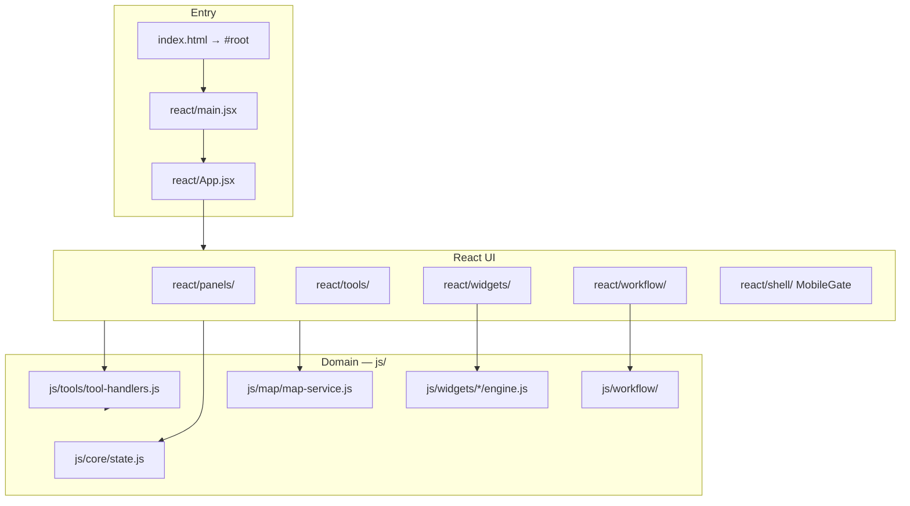

# GIS Toolbox Architecture

> Post-migration reference (2026-06-06). The app is a **React-owned UI** over imperative map/domain services in `js/`.

---

## Overview



**Rule:** React renders UI and calls into `js/` for GIS logic and map mutations. MapLibre stays **imperative** — never in the React render tree.

---

## Entry and boot

| File | Role |
|------|------|
| `index.html` | Minimal shell: `<div id="root">`, CSS links, Vite entry |
| `react/main.jsx` | `bootstrapGlobals()` then `createRoot(#root).render(<App />)` |
| `react/App.jsx` | Layout, providers, boot effects (`setupAppWiring`, session restore) |
| `js/core/bootstrap-globals.js` | Exposes npm deps on `globalThis` (MapLibre, Turf, Papa, XLSX, …) |
| `js/tools/tool-handlers.js` | `APP_ACTIONS`, `open*` handlers, bus wiring, drag/drop, logs |

Boot sequence:

1. Vite loads `react/main.jsx`
2. `bootstrapGlobals()` attaches CDN-compat globals for legacy `js/` imports
3. `App` mounts → `setupAppWiring()` binds `data-app-action` delegation and event bus
4. `restoreSessionIfAvailable()` loads IndexedDB session
5. Map initializes via `MapView` → `mapService`

---

## State and reactivity

| Layer | Mechanism |
|-------|-----------|
| **Source of truth** | `js/core/state.js` — mutable singleton (layers, active layer, UI flags) |
| **React subscriptions** | `react/providers/AppStore.jsx` — thin Zustand store mirroring state shape |
| **Cross-cutting events** | `js/core/event-bus.js` — `layers:changed`, `selection:changed`, `ui:refresh`, … |
| **Persistence** | `js/core/session-store.js` — IndexedDB autosave (2s debounce) |

React panels read via `useAppStore` selectors. Domain code mutates `state.js` and emits bus events; the store bridge calls `bumpRefresh()` on `ui:refresh` and layer events.

**Do not** add `refreshUI()` / `innerHTML` panel renders. New UI surfaces are React components.

---

## GIS tools (single-step operations)

Pattern for one input → one operation → new layer:

```
js/tools/gis-tools.js       — pure/async turf operations
js/tools/tool-catalog.js    — V1 gating, categories, action IDs
js/tools/tool-handlers.js   — open*Dialog handlers
react/tools/*Dialog.jsx     — modal UI
```

- Panel buttons use `data-app-action="openBuffer"` (delegated in `setupAppWiring`)
- Dialogs mount via `openReactIsland` or inline modal host
- Logic stays in `gis-tools.js`; dialogs collect params and call handlers

See `react/panels/GisToolsPanel.jsx` for the map-tools panel.

---

## GIS widgets (multi-step wizards)

Pattern for wizards with map interaction, preview, and bulk edits:

```
js/widgets/<id>/engine.js       — pure logic (Vitest first)
js/widgets/<id>/controller.js   — opens modal, wires map/layer callbacks
react/widgets/<Widget>Dialog.jsx
react/widgets/mount<Widget>Dialog.jsx
js/widgets/registry.js          — SINGLE registration point
```

**Registry** (`js/widgets/registry.js`):

- `GIS_WIDGETS` array — label, icon, action, `open` controller
- `buildWidgetActions(getCtx)` — merges into `APP_ACTIONS`
- `openWidget(type, ctx)` — programmatic open

**WidgetContext** (`js/widgets/widget-context.js` + `widget-types.js`):

- `getLayers()`, `mapService`, `addLayer`, `createSpatialDataset`
- `showToast`, `setActiveLayer`, selection helpers

**Mount flow:** controller → `openReactIsland` → dynamic import of `mount*Dialog.jsx` → `mountIsland`.

Panel buttons: `react/panels/WidgetPanel.jsx` reads `GIS_WIDGETS` directly.

Full authoring guide: [WIDGET_AUTHORING.md](WIDGET_AUTHORING.md).

---

## Coordinate reference systems (CRS)

- **Domain module:** `js/crs/` — EPSG registry, detection, geometry reprojection (proj4), layer helpers
- **Canonical display CRS:** EPSG:4326 for map + Turf; non-geographic layers flagged until user reprojects
- **Import policy:** warn-only — set truthful `schema.crs`, show warnings; no auto-reproject on ingest
- **Shared UI:** `react/widgets/shared/CrsPicker.jsx` — used by import confirm, export, Reproject tool, pipeline inspector
- **Notation vs projection:** DD/DMS/UTM stays in `js/tools/coordinates.js`; CRS stays in `js/crs/`
- **CRS Manager widget:** implemented under `js/widgets/crs-manager/` but **hidden from the GIS Widgets panel** (2026-06-22). Use Reproject tool or export CRS instead. See [CRS_MANAGER.md](CRS_MANAGER.md).

---

## Workflow editor

```
js/workflow/                    — pipeline store, node execute/validate, engine
react/workflow/WorkflowOverlay.jsx — full-screen overlay shell
react/workflow/PipelineEditor.jsx  — React Flow canvas
react/workflow/inspectors/         — per-node config forms
react/workflow/InspectorPanel.jsx  — picks inspector by node.type
react/workflow/DataPreviewPanel.jsx
```

- Node classes in `js/workflow/nodes/` keep **execute / validate / toJSON** only
- Inspector UI is React — config bound directly to `node.config` (no `renderInspector`)
- Opened via `getWorkflowOverlay()` in `tool-handlers.js` → `mountWorkflowOverlay`

---

## Map layer

| File | Role |
|------|------|
| `js/map/map-service.js` | Facade over MapLibre manager |
| `js/map/map-manager.js` | Imperative map, layers, popups, selection |
| `js/map/draw-manager.js` | Draw tools |
| `react/map/MapView.jsx` | Mount point only — no MapLibre in React tree |
| `react/map/SelectionBar.jsx` | Selection UI; subscribes to `selection:changed` |

Dual-screen: `js/dual-screen/` — BroadcastChannel protocol unchanged; `map-window.html` for secondary window.

---

## Modals, toasts, mobile

| Concern | Implementation |
|---------|----------------|
| Modals | `react/ui/ModalHost.jsx` + `js/ui/modals.js` subscriber API |
| Toasts | `react/ui/ToastHost.jsx` + `js/ui/toast.js` |
| Mobile | `react/shell/MobileGate.jsx` — persistent splash below 768px; no mobile app UI |
| Logs | Vanilla DOM in `App.jsx`, wired by `setupLogsPanel()` — React port deferred |

---

## Build and PWA

- **Dev:** `npm run dev` (Vite)
- **Prod:** `npm run build` → `dist/` with code-split chunks
- **PWA:** `vite-plugin-pwa` — `sw.js`, precache, offline shell
- **Test:** `npm test` (Vitest, Node)
- **Smoke:** `npm run preview` + `npm run smoke:preview` (Playwright)

Vendor chunk bundles MapLibre + Turf (~2.5 MB). `workbox.maximumFileSizeToCacheInBytes` raised to 3 MiB in `vite.config.js`.

---

## Adding new features

| Type | Where to add |
|------|--------------|
| New widget | `engine.js` + `controller.js` + `react/widgets/` + `registry.js` entry |
| New GIS tool | `gis-tools.js` + `tool-catalog.js` + `react/tools/*Dialog.jsx` + handler in `tool-handlers.js` |
| New workflow node | `js/workflow/nodes/<type>.js` + `react/workflow/inspectors/<Type>Inspector.jsx` |
| New panel UI | `react/panels/` or `react/` component; wire via `App.jsx` or store |

**Never:**

- Reintroduce `js/app.js` or legacy `innerHTML` panels
- Add `WidgetBase` or feature-flag rollback paths
- Put MapLibre instances inside React component render

---

## Related docs

- [WIDGET_AUTHORING.md](WIDGET_AUTHORING.md) — widget checklist
- [REACT_FINISH_PLAN.md](REACT_FINISH_PLAN.md) — migration phases (complete)
- [HANDOFF.md](../HANDOFF.md) — session handoff
- [AGENTS.md](../AGENTS.md) — agent quick map
