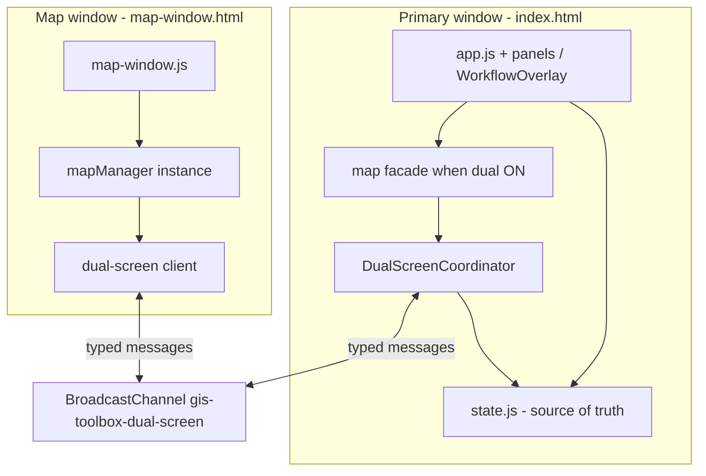

# Dual Screen Mode — product & implementation plan

**Status:** Build in progress — Phase 0–1 done; Phase 2–3 in progress (branch `cursor/dual-screen-phase-1-2-3-99de`)  
**Last updated:** 2026-06-04  
**Branding:** **Dual Screen Mode** (not “Duel”)

---

## Summary

Dual Screen Mode lets GIS Toolbox run as **one logical app across two browser windows**:

- **Primary window** (`index.html`): data, panels, modals, workflow editor, session save.
- **Secondary window** (`map-window.html`): fullscreen MapLibre map with minimal header (basemap, 2D/3D, map-native controls).

The user’s mental model is “the **same map** on a second monitor.” Technically, browsers cannot move a live WebGL map between windows; we **synchronize application state** so both windows behave as one app.

**Mobile:** No Dual Screen entry points; no behavior change on mobile. May remove mobile entirely later.

---

## App sections (code names)

| User description | Code / DOM |
|------------------|------------|
| **Section 1** — default view: map center, left/right panels | **`app-layout`**: `panel-left`, **`panel-center`** (`#map-container`), `panel-right`. Boot: `js/app.js` → `initMap()` → `mapManager.init('map-container')`. |
| **Section 2** — Data Pipeline Editor | **`WorkflowOverlay`** (`js/workflow/workflow-overlay.js`), DOM **`#wf-overlay`**, title **“Data Pipeline Editor”**. Open: header **`#btn-workflow`**; back: **`#wf-back`** (“← Back to Map”). Events: `workflow:opened` / `workflow:closed`. |

Section 2 is a **full-screen overlay** on the same page, not a separate route.

---

## Product decisions (locked)

| # | Decision |
|---|----------|
| 1 | Branding: **Dual Screen Mode** in UI and code (`dual-screen`). |
| 2 | **Basemap + 2D/3D only on secondary header** while dual is on; hide duplicates on primary. Same secondary chrome for Section 1 and Section 2. |
| 3 | **Draw + import fence on secondary map** in v1 (primary header buttons forward commands). |
| 4 | **Feature popups on map window**; **edit / attribute modals on primary** (`POPUP_ACTION` → `openFeatureEditor`). |
| 5 | **One secondary map window max** in v1. |
| 6 | **Laptop / single monitor:** Dual Screen still opens second window (user can snap). **Keep** existing workflow toggle (`#btn-workflow` / `#wf-back`) for users without dual. |
| 7 | **Mobile:** unaffected; hide Dual Screen controls when `state.ui.isMobile`. |

---

## User flows

### How users enter Dual Screen Mode

| Location | Control |
|----------|---------|
| Main header | **`#btn-dual-screen`** — “Dual Screen” (desktop only) |
| Workflow top bar | Same control in **`wf-topbar`** (Phase 3) |

Open only from a **direct click** (`window.open`); store `Window` reference; if already open, `focus()`.

### Section 1 — primary while dual is on

- Center map **hidden**; optional placeholder: “Map open in Dual Screen window.”
- Left/right panels **wider** (CSS: `.app-layout.dual-screen-active`).
- Import, layers, tools, widgets, modals stay on primary.
- **No** basemap / 2D–3D on primary header while dual is on.

### Section 1 — secondary

- Fullscreen map + minimal header (basemap, 2D/3D, exit Dual Screen).
- MapLibre controls: measure, coordinates (existing `map-manager.js`).
- Popups, context menu, instructional toasts on map window.
- File drop on map → forward to primary import pipeline.

### Section 2 — primary while dual is on

- **No change** to workflow canvas / palette / inspector.
- User does **not** need “Back to Map” to see pipeline results; **Add to map** updates external map via sync.
- Existing **Back to Map** remains for single-screen users.

### Section 2 — secondary

- **Identical** map window as Section 1 (same `map-window.html`).

### Exit Dual Screen Mode

- User closes secondary or clicks **Exit Dual Screen**.
- Primary: tear down channel, **re-init** `#map-container`, replay layers from `state.js`, restore layout and header toggles.

---

## Architecture



### Rules

1. **Dual off:** today’s code path only — no regression.
2. **Dual on:** **one live MapLibre** instance (secondary only); primary **destroys** embedded map (`mapManager.destroy()`).
3. **Primary** owns `state.js`, `sessionStore`, import, workflow, modals.
4. **Secondary** does **not** run full `app.js` or session restore.
5. **`mapManager` facade** on primary: when dual active, layer/viewport operations **sync** instead of rendering locally.

### Why not two full apps?

Loading `index.html` twice duplicates state, breaks session save, and strands tools. Use **`map-window.html` + coordinator + facade**.

---

## Sync protocol (v1)

**Channel name:** `gis-toolbox-dual-screen`  
**Implementation:** `js/dual-screen/channel.js`  
**Types:** `js/dual-screen/protocol.js`

**Envelope:**

```js
{ v: 1, role: 'primary' | 'secondary', msgId: string, type: string, payload: object, ts: number }
```

| Type | Direction | Purpose |
|------|-----------|---------|
| `HELLO` | secondary → primary | Secondary ready |
| `SNAPSHOT` | primary → secondary | Full map state: layers, styles, order, visibility, viewport, basemap, 3D |
| `LAYER_ADD` | primary → secondary | New/updated layer + geojson |
| `LAYER_UPDATE` | primary → secondary | Geojson/style patch |
| `LAYER_REMOVE` | primary → secondary | Remove layer id |
| `LAYER_ORDER` | primary → secondary | Ordered layer ids |
| `LAYER_STYLE` | primary → secondary | Style per layer |
| `LAYER_VISIBILITY` | primary → secondary | Visible flag |
| `VIEWPORT` | both | center, zoom, bearing, pitch; debounced ~80ms; `source` field |
| `SELECTION` | both | layerId + feature indices |
| `MAP_CHROME` | secondary → primary (authoritative) | basemap, 3d |
| `DRAW_CMD` | primary → secondary | Start/stop draw, tool, target layer |
| `DRAW_EVENT` | secondary → primary | Feature created/edited/deleted |
| `FENCE_SET` / `FENCE_CLEAR` | secondary ↔ primary | Import fence geometry |
| `FILE_DROP` | secondary → primary | File metadata + buffers for import |
| `POPUP_ACTION` | secondary → primary | e.g. `editFeature` { layerId, featureIndex } |
| `TOAST` | primary → secondary | Map-only instructional text |
| `BYE` | secondary → primary | Window closing |
| `PING` / `PONG` | both | Optional heartbeat |

**Loop prevention:**

- Tag viewport messages with `source` (`primary` | `secondary`); ignore self-echo.
- Monotonic `msgId` or ignore duplicate ids.
- Layer data messages originate from **primary** except `DRAW_EVENT` / fence uploads.

**Performance:**

- Do **not** sync hover or high-frequency pointer events.
- Large GeoJSON: send on add/update only; accept ~2× memory while dual is on for huge layers (v1); later: IndexedDB version pull.

---

## File layout

| Path | Role |
|------|------|
| `docs/DUAL_SCREEN_MODE.md` | This plan (source of truth) |
| `js/dual-screen/protocol.js` | Message types, envelope helpers |
| `js/dual-screen/channel.js` | BroadcastChannel wrapper |
| `js/dual-screen/coordinator.js` | Activate/deactivate, window lifecycle, snapshots |
| `js/dual-screen/map-facade.js` | Patch `mapManager` when dual active |
| `map-window.html` | Secondary shell |
| `css/map-window.css` | Fullscreen map + minimal header |
| `js/map-window.js` | Secondary bootstrap |
| `js/map/map-manager.js` | `destroy()` for primary teardown |
| `js/app.js` | Dual Screen button, hooks, facade install |
| `index.html` | `#btn-dual-screen` |
| `css/main.css` | `.dual-screen-active` layout |
| `js/workflow/workflow-overlay.js` | Workflow top bar button (Phase 3) |
| `tests/dual-screen-protocol.test.js` | Protocol unit tests |
| `sw.js` | Cache new assets (bump `CACHE_VERSION`) |

---

## Implementation phases

### Phase 0 — Foundation ✅

- [x] `protocol.js`, `channel.js`
- [x] `map-window.html`, `map-window.css`, `map-window.js`
- [x] Viewport sync + `HELLO` / `SNAPSHOT` skeleton
- [x] Vitest: `tests/dual-screen-protocol.test.js`
- [x] `sw.js` cache entries

**Exit:** Two windows connect; viewport sync works in manual test.

### Phase 1 — Section 1 MVP ✅

- [x] `coordinator.js`: activate/deactivate, window `closed` poll, snapshot, restore
- [x] `map-facade.js`: core methods delegated when dual active
- [x] `#btn-dual-screen` in main header (hidden on mobile via CSS)
- [x] CSS `.app-layout.dual-screen-active` — hide center map, widen panels
- [x] Hide primary basemap/dimension toggles while dual on
- [x] `bus.on('layers:changed')` → sync when active
- [x] Close secondary → restore map in `#map-container` from `getLayers()`
- [x] `LAYER_ORDER`, `MAP_CHROME`, `refreshLayerData` facade; viewport bounds sync
- [x] `npm test` green (incl. `boundsFromViewportPayload`)
- [ ] Manual QA: import + layer sync + fit bounds on dual map

**Exit:** Import on primary → layer on panel + external map; exit dual → map back in center.

### Phase 2 — Map interactions (v1 scope: draw/fence) ✅

- [x] Forward `#btn-draw-layer`, `#btn-fence` to secondary (`DRAW_CMD`, fence handlers)
- [x] Draw toolbar on secondary map container
- [x] Context menu + feature popup on secondary
- [x] `POPUP_ACTION` → primary `openFeatureEditor`
- [x] File drop on secondary → primary `handleFileImport`
- [x] Facade `getBounds()` from last secondary `VIEWPORT` (with bounds)
- [x] Routed toasts for map instructions (`TOAST` + map-window toast)
- [ ] Manual QA: draw, fence, popup edit, file drop on secondary

### Phase 3 — Section 2 (workflow) (partial)

- [x] Dual Screen button on `wf-topbar` (`#wf-dual-screen`)
- [x] `addToMap` / `updateMapLayer` / `removeFromMap` through facade (unchanged API)
- [ ] Manual QA: workflow + dual open → Run → Add to map → visible on external map

### Phase 4 — Polish

- [ ] Popup blocked → toast on primary
- [ ] `BYE` / `beforeunload` on secondary
- [ ] Optional `sessionStorage` hint `dualScreenActive` (UX only, not data)
- [ ] Manual regression checklist (below)
- [ ] `HANDOFF.md` updated each session

**Explicitly later:** detachable panels, multiple map windows, workspace presets, synchronized cursors, mobile dual screen.

---

## Primary map facade (design)

When `coordinator.isActive`:

| `mapManager` method | Behavior |
|---------------------|----------|
| `addLayer` / `removeLayer` / `toggleLayer` / `setLayerStyle` / `syncLayerOrder` / `refreshLayerData` | Broadcast to secondary; no local map |
| `fitToAll` / `fitToLayers` | Broadcast `VIEWPORT` or fit command |
| `setBasemap` / `enable3D` / `disable3D` | Broadcast `MAP_CHROME` (or secondary-only in dual) |
| `getBounds` | Return last secondary viewport bounds |
| `getMap()` | `null` on primary while dual on |
| `resize()` | No-op on primary; secondary handles |
| `destroy()` | Called on activate (primary) |

When dual off: pass through to real `mapManager` methods.

Install from `app.js` after imports: `installDualScreenMapFacade(mapManager, coordinator)`.

---

## UI spec

### Secondary header (both sections)

- Basemap toggle (Voyager / Satellite)
- 2D / 3D toggle
- **Exit Dual Screen** button
- (No import, workflow, or layer panels)

### Primary header while dual on

- Hide `#basemap-toggle`, `#dimension-toggle` (or disable)
- Show **Dual Screen** as active / “Exit” toggle

### Placeholder (optional)

`#map-container` when dual on:

```html
<div class="dual-screen-placeholder">Map is open in Dual Screen window.</div>
```

---

## “Don’t break the app”

### Automated

- All existing Vitest tests pass with dual modules loaded but **inactive**.
- `tests/dual-screen-protocol.test.js` — envelope, echo guard, type constants.

### Manual regression

- [ ] Fresh load, import, export — dual **off**
- [ ] Dual on: import, visibility, style, delete layer
- [ ] Pan/zoom secondary; clip-to-extent uses correct bounds
- [ ] Draw polygon on secondary (Phase 2)
- [ ] Import fence on secondary (Phase 2)
- [ ] Popup → Edit opens modal on primary (Phase 2)
- [ ] Drop file on secondary map (Phase 2)
- [ ] Close secondary → map restored in center
- [ ] Workflow + dual → Run → Add to map (Phase 3)
- [ ] Workflow Back to Map with dual **off**
- [ ] Mobile width: no dual button; existing mobile map tab OK

---

## Risks & mitigations

| Risk | Mitigation |
|------|------------|
| `mapManager` widely coupled | Facade + grep checklist; dual off = zero patch path |
| Large GeoJSON sync slow | Snapshot on HELLO + incremental updates only |
| Two maps GPU cost | Only one MapLibre while dual on |
| Cross-window event bus | Explicit message types; no shared `bus` |
| Session double-save | Secondary never calls `sessionStore` |
| Re-init on exit blank map | Replay all layers from `getLayers()` after `init()` |
| Draw with no primary map | Draw runs on secondary only (Phase 2) |

---

## Git / PR

- **Branch:** `cursor/dual-screen-mode-ccf7`
- **Base:** `main`
- Commits: plan doc → Phase 0 → Phase 1 increments
- After merge: new agent reads this file + `HANDOFF.md`

---

## Agent handoff prompt (copy after squash-merge)

```
Read HANDOFF.md and docs/DUAL_SCREEN_MODE.md first.

Continue Dual Screen Mode for GIS Toolbox. Phase 0 should be merged; continue from the “Implementation phases” checklist (Phase 1 → 4).

Rules:
- Test-first: extend tests/dual-screen-protocol.test.js; keep npm test green.
- Dual off must not change behavior.
- One map window max; mobile unchanged.
- Primary owns state + sessionStore; secondary is map-window.html only.
- Follow decisions in docs/DUAL_SCREEN_MODE.md.

Start with the first unchecked Phase 1 item in the plan doc, then Phase 2 (draw/fence on secondary), then Phase 3 (workflow top bar button).
```
