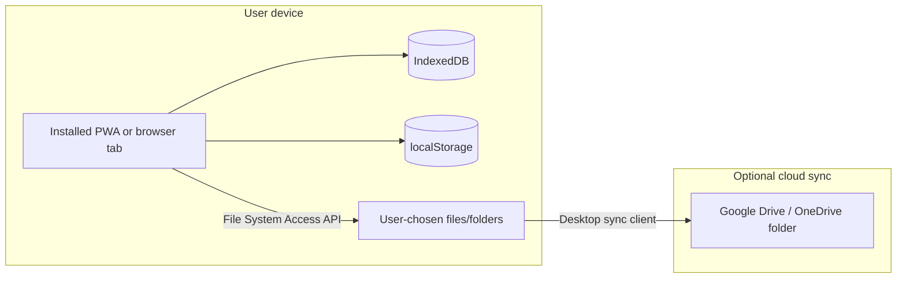

# PWA User Persistence Plan

> **Status:** Future plan (advisory). Not yet implemented.  
> **Created:** 2026-06-07  
> **Goal:** Individual-user UX without server-side accounts — local settings, project persistence, OS integration, and optional cloud-synced folders.

---

## The mental model

A PWA gives each **browser origin + browser profile** a private sandbox. There is no server-side user record, but the app can still feel personal: settings, recent work, named projects, and optional links to files the user controls (Downloads, Desktop, or a synced Drive/OneDrive folder).

**Not accounts** — data is tied to *this device, this browser, this profile*. A different browser, incognito window, or another computer does not see the same data unless the user exports/imports or points at a shared folder.

---

## What persists, and when it disappears

| Storage | Typical size | Survives | Cleared when |
| --- | --- | --- | --- |
| **localStorage** | ~5 MB | Tab close, reboot | User clears *site data*; rarely by “history only” |
| **sessionStorage** | ~5 MB | Tab/session only | Tab closed |
| **IndexedDB** | Large (GB-class on desktop) | Tab close, reboot, PWA restart | User clears site data; storage eviction under disk pressure; iOS Safari can evict aggressively |
| **Cache Storage** (service worker) | App shell + cached assets | Same as above | Same + SW update/cleanup |
| **User files** (export / picked folder) | Unlimited (user disk) | Until user deletes | User controls |

**Important nuance:** “Clear browsing history” alone usually does **not** wipe IndexedDB. Users must clear **cookies and site data** (or uninstall the PWA) to lose in-app saves. Private/incognito sessions are ephemeral.

GIS Toolbox already hits the right layer for heavy data: [js/core/session-store.js](../js/core/session-store.js) (IndexedDB for layers/styles), [js/workflow/workflow-store.js](../js/workflow/workflow-store.js) (IDB for workflow node cache), and [js/map/palette-store.js](../js/map/palette-store.js) (localStorage for palette favorites).

---

## What you already use well

- **Auto-restore session** — layers + styles debounced to IndexedDB; prompt on boot via `restoreSessionIfAvailable()` in [js/tools/tool-handlers.js](../js/tools/tool-handlers.js).
- **Workflow durability** — pipeline JSON in sessionStorage; large node payloads in IndexedDB (with size skip for >25 MB nodes).
- **Offline-ish app** — [vite.config.js](../vite.config.js) precaches the app shell; runtime cache for CDN libs (Papa, XLSX, etc.).
- **Installable** — `display: standalone` in manifest; home-screen / taskbar icon.
- **Explicit export** — workflow JSON download, layer export formats, log download.

That is already a strong “individual user workspace” foundation without any backend.

---

## Storage options (no server accounts)

### 1. In-browser databases (what you have + extensions)

**Best for:** automatic continuity, preferences, multiple named projects, recent ArcGIS URLs, default map settings.

- **localStorage** — small flags and prefs (theme, units, “always use worker for imports”, last export format). Fast, synchronous; keep payloads tiny.
- **IndexedDB** — layers, workflows, project library, file-handle permission tokens (see below). Session store is the right pattern; optional *per-layer upserts* avoid full rewrite and quota issues.
- **sessionStorage** — tab-scoped scratch (current workflow graph); correct choice for “this editing session only.”

**UX pattern:** “It remembers my work” without the user managing files.

### 2. Downloadable project files (portable, cloud-friendly)

**Best for:** backup, sharing, opening on another machine, storing in Google Drive / OneDrive *as files*.

- Single **`.gis-toolbox` bundle** (ZIP or JSON): layers (GeoJSON/tables), styles, workflow, metadata, version stamp.
- User saves to `Documents/GIS Projects/` or a synced cloud folder manually (or via “Save as…” — see next section).
- **No OAuth required** — the cloud is just a file store the user manages.

**UX pattern:** “My project lives in a folder I recognize,” like a `.psd` or `.qgz`.

### 3. File System Access API — “workspace folder” (closest to local DB + Drive)

**Best for:** power users who want read/write to a **real folder** (including OneDrive/Google Drive **sync folders** on desktop).

- `showDirectoryPicker()` once → user picks e.g. `OneDrive/GIS Toolbox/`.
- App reads/writes `project-name.gis-toolbox`, `settings.json`, `recent/` inside that folder.
- **`FileSystemHandle` permissions** can be persisted in IndexedDB so re-opens do not always re-prompt (until revoked).
- **Not used in the repo today** (no `showOpenFilePicker` / `showDirectoryPicker` yet).

**Limits:**

- Strongest on **Chrome/Edge desktop**. Safari/Firefox support is partial or missing for directory pickers.
- **Mobile:** usually no persistent folder access; fall back to Share / Open / Download.
- **Not** direct Google Drive API — user syncs a local folder; the app sees normal files.

**UX pattern:** “This app uses *my* project folder,” similar to VS Code opening a workspace.

### 4. OS integration (PWA manifest features)

**Best for:** reducing friction to open GIS data and launch common tasks.

| Feature | User benefit | Fit for GIS Toolbox |
| --- | --- | --- |
| **file_handlers** | Double-click `.geojson`, `.kml`, `.kmz` → opens in app | High — natural entry for GIS users |
| **share_target** | Mobile “Share to GIS Toolbox” from Files/Drive apps | High on Android |
| **shortcuts** | Long-press icon: “Import”, “New workflow”, “Restore last session” | Medium |
| **launch_handler** | Reuse open window instead of duplicate tabs | Medium for dual-screen users |
| **protocol_handlers** | Custom `web+gistoolbox://` links | Low unless you need deep links |

None of these require accounts; they improve *how* the user reaches the app and data.

### 5. What does **not** work without accounts (or extra infrastructure)

- **True cross-device sync** (phone ↔ laptop) with conflict resolution — needs server or user-managed files + manual merge.
- **Native Google Drive / OneDrive picker API** — requires OAuth and API keys (account-linked).
- **Push notifications** for “export finished” — needs a push service (often server); optional self-hosted, still not “no backend.”
- **Guaranteed permanent storage** — `navigator.storage.persist()` can request eviction protection; browsers may still deny; not a substitute for user-owned files.

---

## “Local admin settings” — what makes sense for GIS Toolbox

A **Settings** area (all client-side) could group:

**Preferences (localStorage / small IDB record)**

- Default basemap, coordinate display, clustering threshold
- Import worker threshold
- Auto-restore session on/off
- Dual-screen defaults

**Workspace (IndexedDB)**

- Named projects (multiple snapshots beyond single “last session”)
- Recent files / recent ArcGIS REST endpoints
- Saved palette favorites (already exists)

**Files (user-controlled)**

- Export/import project bundle
- Optional linked workspace folder (File System Access API)

**Storage health (transparency builds trust)**

- Show estimated usage, last save time, quota warning (quota already surfaced on save failure)
- “Export backup” and “Clear local data” buttons

This gives a **personal admin panel** without profiles or login.

---

## Cool PWA UX ideas (ranked by impact vs effort)

**High impact, fits no-account model**

1. **Named projects + export/import bundle** — portable, backup-friendly, works everywhere.
2. **file_handlers + share_target** — open GIS files from OS; huge perceived “app-ness.”
3. **User settings store** — defaults persist across sessions (basemap, units, import behavior).
4. **Install prompt + shortcuts** — standalone icon with “Import GeoJSON” shortcut.

**Medium impact**

5. **Workspace folder** (desktop Chrome/Edge) — auto-save projects into user’s synced cloud folder.
6. **Storage dashboard** — “Your local data: 42 MB, 3 projects” with backup/clear.
7. **Recent projects list** on home — resume in one click.

**Nice polish**

8. **`navigator.storage.persist()`** request after heavy imports — ask browser not to evict.
9. **Web Share API** on export — “Share layer” to email/Files on mobile.
10. **Launch handler** — single-window behavior when opening files.

**Lower priority for this app**

- Push notifications, background sync queues (more valuable with server-side jobs; work is client-side).

---

## Google Drive / OneDrive — practical answer

You cannot silently attach to a user’s cloud drive without their account APIs. Three realistic patterns:

1. **Export/download** — user saves `project.gis-toolbox` to Drive via browser or OS (simplest, universal).
2. **Synced folder** — desktop user picks `~/OneDrive/GIS Toolbox` as workspace; app reads/writes real files (best “always accessible folder” feel on desktop).
3. **Open from cloud** — user opens file from Drive web UI or mobile Files app via share/open; no persistent link until they save a project file back.

There is no magic “link to a folder” URL that works like a database without either (a) user picking the folder once or (b) cloud OAuth.

---

## Recommendation for GIS Toolbox

Stay **client-first** — the app is already aligned with the right architecture. The biggest UX wins without accounts are:

1. Treat **IndexedDB as “hot workspace”** (fast resume) and **project files as “cold storage”** (backup, share, cloud folders).
2. Add a **small preferences layer** next to palette favorites — same patterns, different keys.
3. Add **OS file integration** (handlers/share) so the PWA feels like a desktop GIS utility, not only a website that remembers the last tab.
4. Optionally add **workspace folder** for desktop power users with synced Drive/OneDrive directories.

Avoid building pseudo-accounts (device IDs + server) unless you later want real sync; file bundles + folder pickers cover most individual-user needs.

---

## Implementation slices (when ready to build)

Natural first slices:

| Slice | Files / areas |
| --- | --- |
| User settings store | `js/core/user-settings.js` — localStorage prefs + defaults merge |
| Project bundle format | `js/core/project-bundle.js` — export/import ZIP with manifest version |
| OS integration | Manifest updates in [vite.config.js](../vite.config.js) — `file_handlers`, `share_target`, `shortcuts` |
| Workspace folder (optional) | `js/core/workspace-folder.js` — File System Access API with handle persistence in IndexedDB |
| Settings UI | `react/panels/` or header menu — preferences + storage dashboard |

Suggested build order: user settings → project bundle export/import → manifest file handlers → workspace folder (desktop only).
