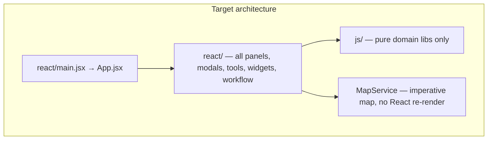

# React Finish Plan — GIS Toolbox

> **Status:** Migration complete — all 6 phases done (2026-06-06)
> **Supersedes:** incremental milestones in [REACT_REFACTOR_PLAN.md](REACT_REFACTOR_PLAN.md) for all remaining work
> **Read first:** agents starting the React finish should read this file end-to-end before touching code

**Goal:** Complete the migration to a **React-owned UI app** in 6 focused phases. Preserve all recent work: widgets (Bulk Update, Spatial Analyzer, Proximity Join), V1 GIS tools, SmartStyle, feature selection, styling/export, and workflow React Flow canvas.

**Not in scope:** Rewriting GIS math, import parsers, or MapLibre internals. Pure logic stays in `js/`.

---

## Phase checklist

| Phase | Summary | Status |
|-------|---------|--------|
| 1 | Delete rollback scaffolding (~8k LOC) | completed |
| 2 | Port last vanilla-only modals + SelectionBar | completed |
| 3 | Remove mobile UI; add persistent MobileGate splash | completed |
| 4 | Full workflow React (overlay, inspectors, preview) | completed |
| 5 | React shell flip (`App.jsx`, delete `app.js`) | completed |
| 6 | Docs, dead CSS, smoke + PWA polish | completed |

---

## What "done" means

You are **not** rewriting GIS math, import parsers, or MapLibre internals. You **are** eliminating every legacy UI path so the app has **one architecture**:



**Done when all of these are true:**

- `index.html` boots a single React root (`#root`), not `js/app.js` as the UI boss
- **Zero** feature-flag rollback paths (delete all `*-feature-flags.js` modules)
- **Zero** legacy `innerHTML` panel/modal renders in app code
- **Zero** `WidgetBase` / legacy widget classes
- Workflow: React overlay + inspector + preview (no `workflow-inspector.js` / SVG canvas)
- Mobile: persistent small-screen gate only (no bottom nav / flyouts)
- **Preserved behaviors** still work: 3 widgets, V1 GIS tools, SmartStyle, selection bar + shortcuts, dual-screen, PWA build
- `npm test` + `npm run build` green; one manual smoke pass on `npm run preview`

---

## What you already have (do not re-port)

These are **React-complete on the primary path** — finish work is **delete scaffolding + wire shell**, not rebuild:

| Area | Keep as-is | Notes |
|------|------------|-------|
| **Widgets** | `js/widgets/*/engine.js`, `controller.js`, `react/widgets/*` | Bulk Update, Spatial Analyzer, Proximity Join |
| **GIS tools** | `react/tools/*Dialog.jsx` (~50 dialogs), `js/tools/gis-tools.js`, `tool-catalog.js` V1 gating | 6 map tools + pipeline subset |
| **Styling** | `react/panels/SmartStylePanel.jsx`, `style-engine.js`, `style-baker.js` | Delete legacy `buildStylePanel` only |
| **Selection** | `map-manager.js` selection APIs, `selection-shortcuts.js`, `ApplyToSelector.jsx` | Move selection **bar** to React; keep map logic in JS |
| **Workflow canvas** | `react/workflow/PipelineEditor.jsx` | Extend, don't replace |
| **Tests** | `tests/*-engine.test.js`, `tool-catalog.test.js`, `selection.test.js`, `style-*.test.js` | Must stay green every phase |

---

## Why the last plan took too long (and how this one is different)

| Old approach | New approach |
|--------------|--------------|
| 12 milestones, dual-path every feature | **Delete rollback first** — one code path only |
| Feature flag per island forever | Flags removed in Phase 1 |
| `app.js` kept growing | `app.js` **shrinks to zero** by Phase 5 |
| Screenshot parity gate per PR | **One** final browser smoke pass |
| Zustand bridge explored then removed | Thin store at shell flip only (wrapper over existing `state.js`) |

Work in **6 phases**, each shippable. Target **~3–4 weeks** of focused agent work.

---

## Phase 1 — Cut the dead weight (1–2 PRs, ~2 days)

**Goal:** Remove ~8,000 lines of rollback code. React becomes the **only** runtime path.

### Delete outright

- Legacy widget UI: `widget-base.js`, `bulk-update.js`, `spatial-analyzer.js`, `proximity-join.js`
- `workflow-canvas.js` + `wfReactFlow=0` branches
- All 8 feature-flag modules + their tests (`js/ui/*-feature-flags.js`, `js/map/map-feature-flags.js`, `js/workflow/workflow-feature-flags.js`)
- Legacy modal/toast DOM fallbacks in `modals.js` / `toast.js` (keep subscriber API)
- Legacy panel renders in `app.js`: `renderLayerList`, `renderFieldList`, `renderOutputPanel`, `buildStylePanel`, `bindStylePanel`, `renderDataPrepTools`
- Every `else { /* legacy HTML modal */ }` branch in migrated `open*` handlers (~40 tools already have React dialogs)

### Simplify controllers

- `js/widgets/*/controller.js`: remove `if (ctx.isReactToolDialogs)` — always `openReactIsland`
- Remove duplicate shims in `react/tools/mountBulkUpdateDialog.jsx` etc. — canonical imports from `react/widgets/`

### Gate

- `npm test` + `npm run build`
- Quick smoke: open each widget, run one V1 GIS tool, toggle SmartStyle, select features + bulk update

---

## Phase 2 — Finish the last vanilla-only UIs (2 PRs, ~3–4 days)

**Goal:** Every user-facing surface has a React component. `app.js` stops owning HTML.

### New React dialogs (port logic from `app.js`, reuse shared primitives)

| Vanilla handler in `app.js` | New React component |
|----------------------------|---------------------|
| `openFilterBuilder` | `react/tools/FilterBuilderDialog.jsx` |
| `openJoinTool` | `react/tools/JoinToolDialog.jsx` |
| `openValidation` | `react/tools/ValidationDialog.jsx` |
| `openTemplateBuilder` | `react/tools/TemplateBuilderDialog.jsx` |
| `openFeatureEditor` | `react/tools/FeatureEditorDialog.jsx` |
| `showDataTable` | `react/tools/DataTableDialog.jsx` |
| `showToolInfo` | `react/tools/ToolGuideDialog.jsx` (or panel) |
| `showMapContextMenu` | `react/map/MapContextMenu.jsx` |

Reuse existing shared UI: `LayerSelect`, `FieldSelect`, modal host.

### Selection bar → React

- New `react/map/SelectionBar.jsx` replaces `#selection-bar` HTML mutations in `updateSelectionUI()`
- Subscribe to `selection:changed` via hook; wire same actions (select all, invert, clear)
- Keep `selection-shortcuts.js` as vanilla (keyboard guards)

### Map popup globals

- Replace `window._mapPopupNav` / `window._mapPopupEdit` inline handlers in `map-manager.js` with delegated events or a small React popup portal

### Gate

- Extend `tests/selection.test.js` if selection bar moves
- Smoke: filter badge, data table, feature editor from map popup, GIS tool guide

---

## Phase 3 — Mobile gate (1 PR, ~1 day)

**Goal:** No mobile app UI. Small screens see a **persistent, non-dismissable** splash.

### Remove

- Mobile markup in `index.html`: bottom nav, mobile content panels, mobile header buttons
- Mobile JS in `app.js`: `renderMobileContent`, `renderMobile*`, `mobileShow*`, FAB/flyout handlers
- `css/mobile.css` (or reduce to splash-only rules)

### Add

- `react/shell/MobileGate.jsx`:
  - Detects viewport below breakpoint (e.g. 768px)
  - Full-screen overlay, **does not dismiss**
  - Shows existing branding/how-to content
  - Message above how-to: *"GIS Toolbox works best on a larger screen. Please use a tablet or desktop for the full experience."*
  - Desktop: component renders nothing

Mount at top of `App.jsx` so it covers everything on small screens.

---

## Phase 4 — Full workflow React (3–4 PRs, ~1–1.5 weeks)

**Goal:** Replace the hybrid workflow shell. Canvas already done; finish inspector + preview + chrome.

### 4a — React workflow shell

- New `react/workflow/WorkflowOverlay.jsx` replaces `workflow-overlay.js` DOM build
- Compose: top bar (run/import/export/clear/examples), palette, `PipelineEditor`, inspector slot, preview slot
- Delete vanilla overlay class when parity confirmed

### 4b — Node inspector architecture (done in batches)

**Pattern** (one-time setup, then repeat per node):

```
js/workflow/nodes/<type>.js     → keep execute/validate/toJSON only
react/workflow/inspectors/      → one <XNodeInspector> per node type
react/workflow/InspectorPanel.jsx → picks inspector by node.type, writes node.config directly
```

- Stop calling `renderInspector()` / `readInspector()` — use controlled React state bound to `node.config`
- Shared inspector primitives: layer picker, field picker, numeric inputs (reuse widget shared components)
- **Batch order** (3 PRs):
  1. Input + output + enrichment nodes (~5 types)
  2. Transform nodes (~17 types) — `transform-nodes.js`
  3. Spatial nodes (~13 types) — `spatial-nodes.js`

### 4c — Preview panel

- New `react/workflow/DataPreviewPanel.jsx` replaces `workflow-data-preview.js`

### Delete when done

- `workflow-inspector.js`, `workflow-data-preview.js`, `workflow-overlay.js`
- `renderInspector` / `readInspector` methods from node classes

### Gate

- Load each `pipelines/*.json` example, configure a node, run pipeline, Add to Map
- `npm test` for workflow engine (unchanged) + inspector config round-trip tests per node category

---

## Phase 5 — React shell flip (2 PRs, ~3–4 days)

**Goal:** `react/App.jsx` owns the page. `app.js` is gone.

### New entry

```
react/main.jsx          → createRoot(#root).render(<App />)
react/App.jsx           → Header, layout, panels, map, providers
react/providers/AppStore.jsx → thin Zustand store mirroring state.js shape
```

**Zustand approach (minimal):**

- Wrap existing `state.js` mutators — don't rewrite data model
- React panels subscribe via selectors instead of `refreshUI()` + prop snapshots
- Keep `event-bus.js` temporarily for map/workflow/draw; bridge bus events into store where needed
- Delete `refreshUI()` / `refreshUINow()` once all subscribers are React

### Move from `app.js` into structured modules

| Concern | New home |
|---------|----------|
| Boot / session restore | `react/App.jsx` effects + `js/core/session-store.js` |
| `APP_ACTIONS` / `invokeAppAction` | `react/actions/app-actions.js` + React event handlers |
| `getWidgetContext()` | `js/widgets/widget-context.js` (already exists) |
| `open*` tool handlers | `js/tools/tool-handlers.js` (thin functions called from React) |
| GIS tools panel buttons | `react/panels/GisToolsPanel.jsx` replaces `renderMapGisToolsPanelHtml()` |
| Widget panel buttons | `react/panels/WidgetPanel.jsx` replaces `renderWidgetPanelHtml()` |

### `index.html` changes

- Replace static panel markup with `<div id="root"></div>`
- Remove CDN script tags (bundled via Vite/npm deps)
- Vite entry: `react/main.jsx`

### Delete

- `js/app.js` (entire file)
- `index.html` static header/panel skeleton (React renders same class names for CSS parity)

### Gate

- Full smoke checklist (import, draw, V1 tools, 3 widgets, SmartStyle export, selection, dual-screen, workflow, PWA preview)
- `tests/event-wiring-regression.test.js` updated for new entry

---

## Phase 6 — Polish and single doc (1 PR, ~1–2 days)

- Update [WIDGET_AUTHORING.md](WIDGET_AUTHORING.md) + add [ARCHITECTURE.md](ARCHITECTURE.md) — one pattern: `engine.js` + React UI + registry
- Mark [REACT_REFACTOR_PLAN.md](REACT_REFACTOR_PLAN.md) as **completed**
- Remove dead CSS (`workflow.css` orphans, mobile rules)
- Logs panel → optional quick React port or defer
- Lighthouse + PWA offline verification on `dist/`
- Update [HANDOFF.md](../HANDOFF.md) with "migration complete"

---

## Agent rules during execution

1. **Never add legacy paths** — no new `innerHTML` panels, no `WidgetBase`, no feature flags
2. **Never extend `app.js`** after Phase 1 — new handlers go in `js/tools/tool-handlers.js` or React components
3. **New features** = `engine.js` + `react/` + registry only (per widget guide)
4. **Every PR**: `npm test` then `npm run build` before merge
5. **Map stays imperative** — UI calls `mapService`, never puts MapLibre in render tree

---

## Risk notes

| Risk | Mitigation |
|------|------------|
| Workflow inspector batch is large | 3 PRs by node category; shared form primitives |
| Visual regressions | Keep same CSS classes in React components (Rule #0 from original plan) |
| Dual-screen breaks on shell flip | Port last within Phase 5; keep BroadcastChannel protocol unchanged |
| Scope creep | Logs panel, full Zustand bus replacement — defer to post-done if needed |

---

## Execution order (summary)

1. **Phase 1** — Delete rollback (biggest clarity win, lowest risk)
2. **Phase 2** — Last vanilla modals + selection bar
3. **Phase 3** — Mobile gate
4. **Phase 4** — Workflow shell + inspectors (parallel batches)
5. **Phase 5** — App shell flip
6. **Phase 6** — Docs + PWA polish
